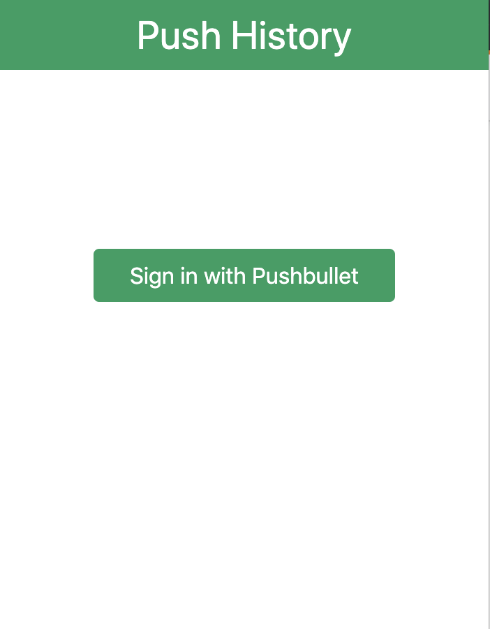
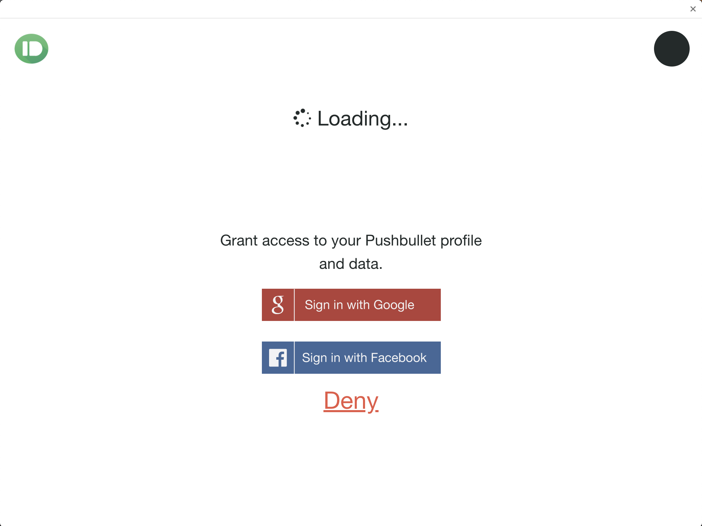
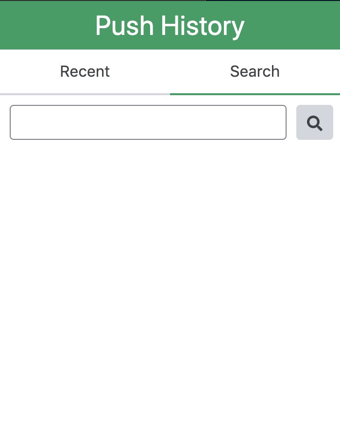

# Welcome to push-history (WIP) 🚧


> A chrome extension for searching through your Pushbullet history

## Install

```sh
npm install
```

## Usage
Run Dev: `npm run watch:dev` 

Build: `npm run build` 

## Screenshots
### Sign In Screen


### OAuth Screen


### Dashboard Screen (Search + History)


### TODO
* Finalize the Search functionality

## Author

👤 **Kenneth Thuku <thuku.ken@live.com>**

* Github: [@ktkization](https://github.com/ktkization)


